# 30DaysOfWebDesign Challenge

A challenge by [@ransegall](https://www.instagram.com/ransegall/) to build the hero section or landing page of app ideas for the next 30 days.

## Goal

The goal of this exercise is to help designers build their design muscle memory by constantly practicing.

## Rules for the Challenge

- Design the hero section of a home page
- 1 hero section per day
- 1 hour max

## Technology and Tools

- Figma

## Project Folder Structure

The folder structure for this project is very simple and straight forward. There is only one folder called screen shots that contains the images of each landing page designed each day.

## Day 1/30

Idea: Online market place where used cars can be bought from sellers and sold to buyers

**Thought Process:**

- Image: Show a car garage.
- Color: Black/White to feel premium.
- Headline: Convey safety for reassurance since that's probably the main objection.

## Day 2/30

**Idea**: A goal-oriented task list app that helps you achieve your goals by tracking your progress and mapping it to a calendar.

**Thought Process:**

- Image: Shows illustrations of how the app works
- Color: Used a monochromatic color to convey calm and soothing feeling.
- Headline: Communicates support of helping users track and achieve their goals

## Day 3/30

Concept 2:

**Idea**: A solar panel that is cheap, durable, and highly efficient.

**Thought Process:**

- Image: An image of a solar panel to showcase what the company is selling
- Color: Black and White to convey premium and durability
- Headline: Convince buyers that the product they want to buyis durable, highly effienct, and cheap.

## Day 4/30

Concept 2:

**Idea**: A startup that helps content creators such as videographers, monetize their work.

**Thought Process:**

- Image: The background picture shows a camera which is an important tool used by creatives(videographers) to perform their work.

- Color: Black and White to convey luxury, premium, and quality service.

- Headline: Communicates the benefit of using the platform which is, making money as a creative.

## Day 5/30

Concept 1:

Concept 2:

**Idea**: A high-speed way to create custom-made, high resolution 3D printed parts

**Thought Process:**

- Image: Show images of 3D objects to match the headline

- Color: Black and White. Added images with pink background to give a calm feeling.

- Headline: Inform users on how to create their own 3D parts with the help of the company.

## Day 6/30

**Idea**: A startup that gives users an easy way to make a donation to a cause of their choice. The startup is looking to increase the number of causes a person can donate to by cutting down on the number of steps required to do so.

**Thought Process:**

- Image: Use memojis to communicate better the feelings of people that need help.

- Color: Black and White.

- Headline: Communicates the end-goal of the platform and how users can donate to a cause or project.

## Day 7/30

**Idea**: A company that helps freelance and on-call workers find jobs.

**Thought Process:**

- Image: Show an image of a worker.

- Color: White and Green to give it a coporeate feel.

- Headline: Communicate to potential users of the website on how to find their next job or income.

## Day 8/30

**Idea**: An app for businesses to manage their customers

**Thought Process:**

- Image: Show an illustration of people working.

- Color: Blue and white to show trust in the brand/business.

- Headline: Communicate the services the platform provides.

## Day 9/30

**Idea**: A software platform that helps people shop for second-hand funiture and decor.

**Thought Process:**

- Image: Show an image of a furniture.

- Color: I used white for the text and a black overlay to make the text on the image more readable.

- Headline: Inform the users what type of products the platform offers.

## Day 10/30

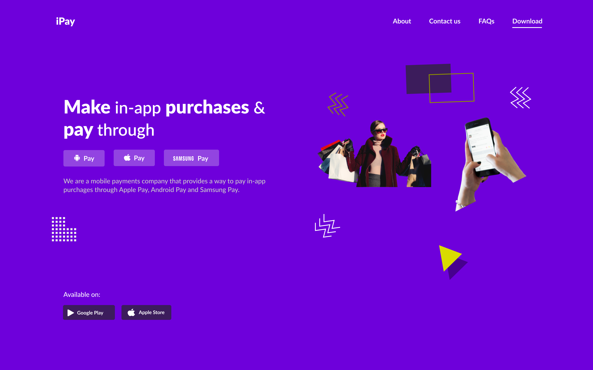;

**Idea**: A mobile payments company that provides a way to pay in-app purchases through Apple pay, Android pay, and Samsung pay.

**Thought Process:**

- Image: Show images of some one interacting with a phone as well as shopping.

- Color: To achieve a premium look and feel, I used purple for the backgrounds and white for the text.

- Headline: Inform users of how they can make payments through various payment services on the platform.

## Day 11/30

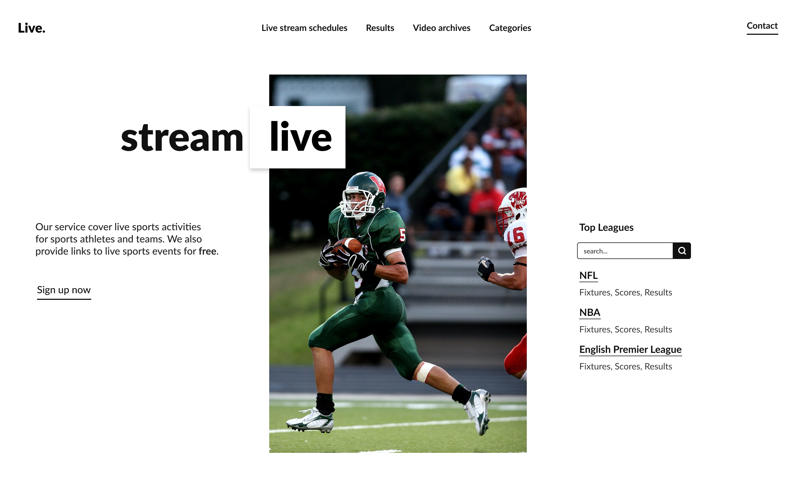;

**Idea**: A live broadcast company for athletes and sports teams.

**Thought Process:**

- Image: Show an image of a sports athlete in a game.

- Color: To achieve a premium and minimal look, I used a plain white background with a black text.

- Headline: In form users that they can stream live sports events for free.

## Day 12/30

;

**Idea**: A startup that lets people easily find nearby parking garages.

**Thought Process:**

- Image: Show an image of a parking garage.

- Color: Used black and white colors to achieve a clean and simple interface.

- Headline: Let users know how to find a parking garage with the help of a search input box.

## Day 13/30

;

**Idea**: A startup that makes it possible to order room service from your hotel.

**Thought Process:**

- Color: Black and white to keep things simple, minimal, and clean.

- Headline: Tell users to order for a room service.

## Day 14/30

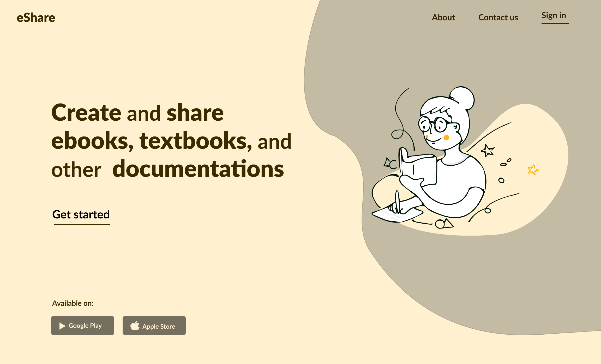;

**Idea**: A startup company working on a platform where people can create and share their own ebooks, textbooks
and documentations.

**Thought Process:**

- Image: Show an illustration of someone writing.

- Color: Used different shades of papaya whip.

- Headline: Tell the users what the platform is about.

## Day 15/30

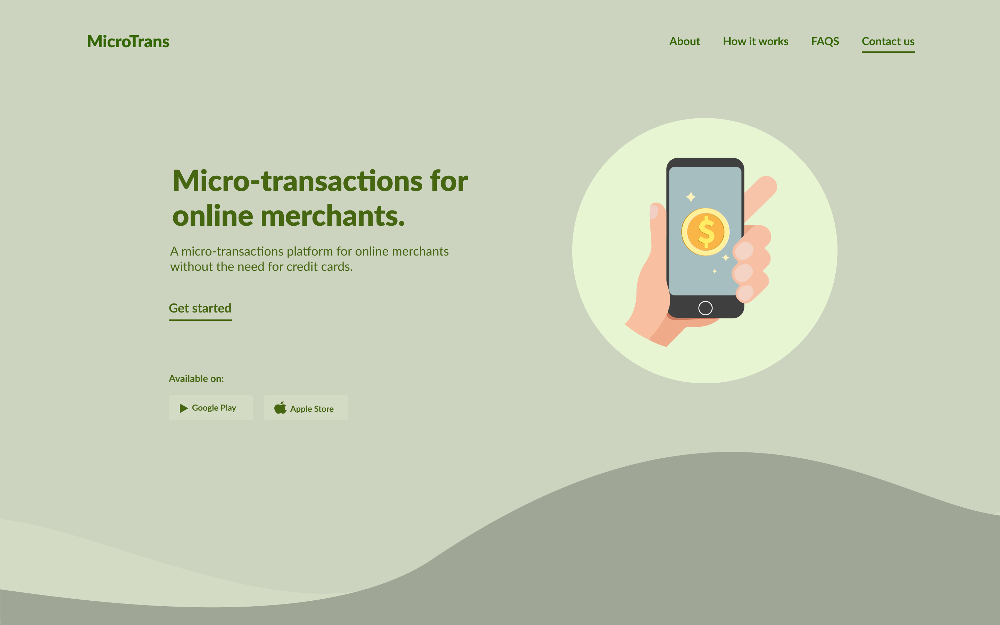;

**Idea**: A platform for micro-transactions for online merchants. The startup wants to eliminate the need for credit cards.

**Thought Process:**

- Image: Show an illustration of a user holding a phone.

- Color: Used different shades of green.

- Headline: Describes what the platform is about and who it is intended for.

## Day 16/30

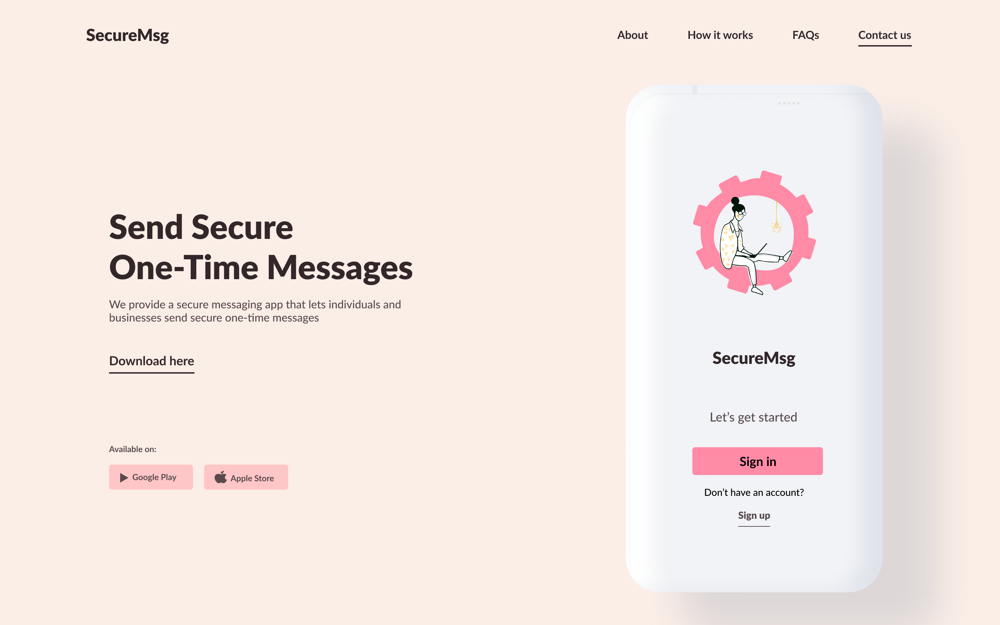;

**Idea**: A secure messaging app that lets individuals and businesses send secure one-time messages.

**Thought Process:**

- Image: Shows an illustration of the mobile version for the messaging platform

- Color: Used different shades of pastel colors.

- Headline: Describes the app's functionality to the user.

## Day 17/30

;

**Idea**:

**Thought Process:**

- Image:

- Color:

- Headline:

## Day 18/30

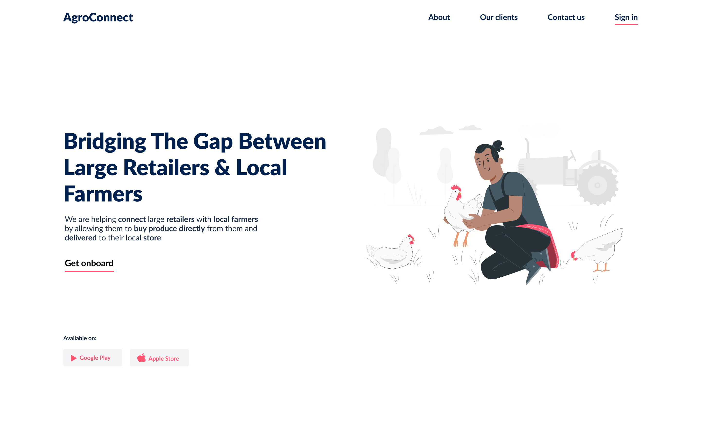;

**Idea**: A company that connects large retailers with local farmers, allowing them to buy produce directly from them and have it delivered to their store locally.

**Thought Process:**

- Image: Used an illustration to show a farmer working on the farm

- Color: Used a dark green and a light shade of dark green for the text color and pink for the highlights.

- Headline: Describe what the platform is about and the services it renders.

## Day 19/30

;

**Idea**: A review platform for restaurants. Users can rate restaurants on their service, experience and food quality.

**Thought Process:**

- Image: Used an illustration to show a user rating a service

- Color: Used a dark violet for the background, white color for the text and violet for the highlights and buttons.

- Headline: Ask users to share their experience using either the web or mobile platform.

## Day 20/30

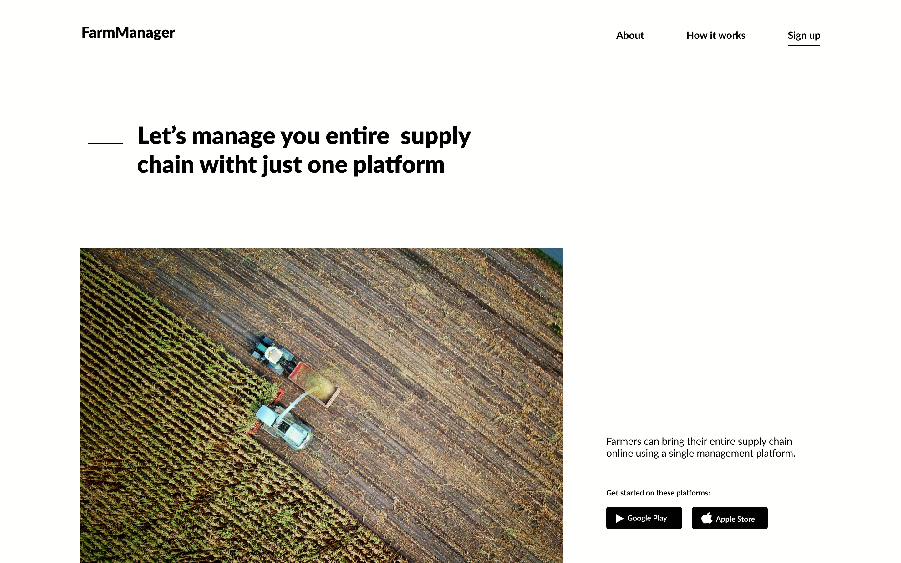;

**Idea**: Farmers can bring their entire chain online using a single management platform.

**Thought Process:**

- Image: Used an image of a farmer on a vast farmland

- Color: Used white and black to give the interface a clean, minimal and premium look.

- Headline: Described the service the company offers.

## Day 21/30

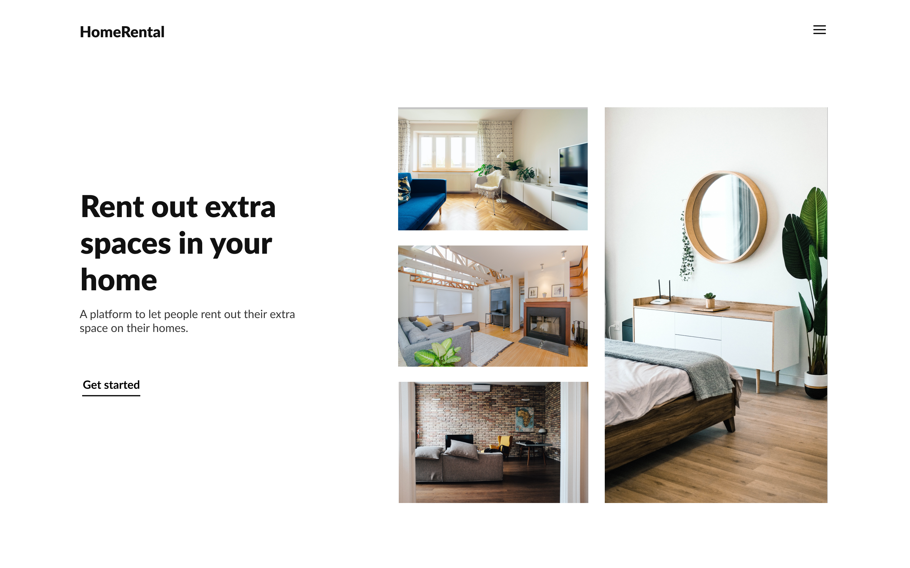;

**Idea**: A platform to let people rent out their extra space on their homes.

**Thought Process:**

- Image: Used images of empty rooms inside of homes

- Color: Used white and black to give the interface a clean, minimal and premium look.

- Headline: Inform users what the platform is about.

## Day 22/30

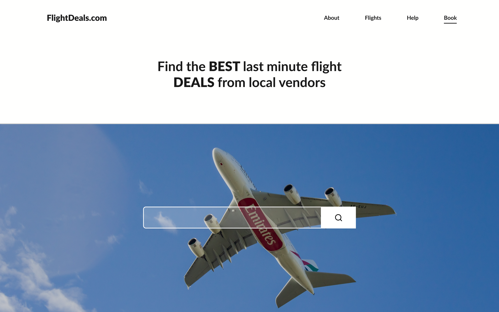;

**Idea**: A startup that wants to take the pain out of international travel booking by creating a market palce where travelers can find last-minute deals from local vendors.

**Thought Process:**

- Image: Used an image of an aircraft flying

- Color: Used color white for the background and color black for the text.

- Headline: A flight booking site.

## Day 23/30

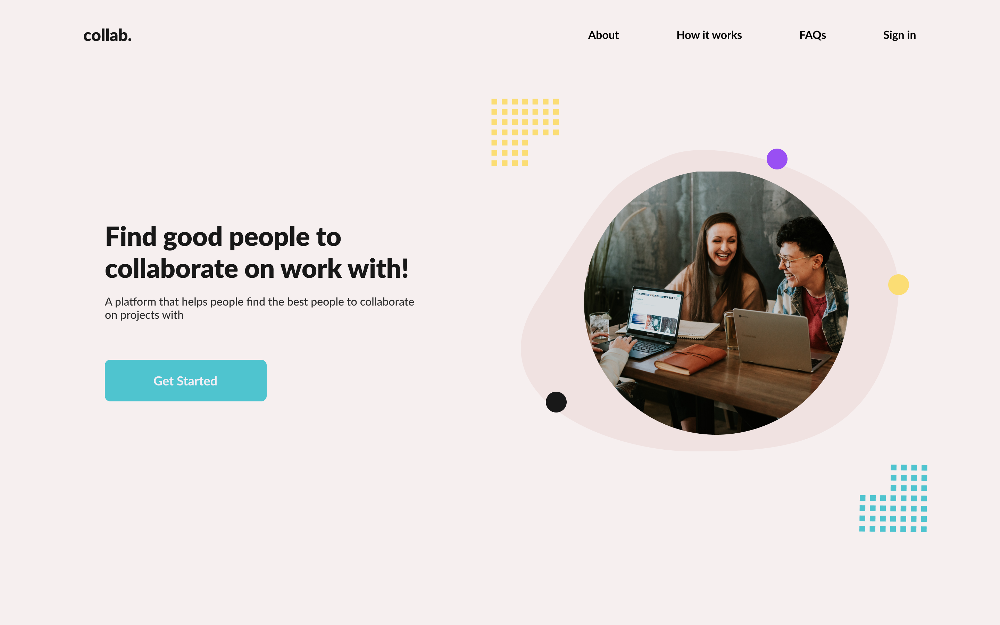;

**Idea**: A platform that helps people find good people to work on projects with

**Thought Process:**

- Image: Used an image of people working together.

- Color: Used a very light shade of red for the background color and color black for the text.

- Headline: A platform that helps people to find collaborators.

## Day 24/30

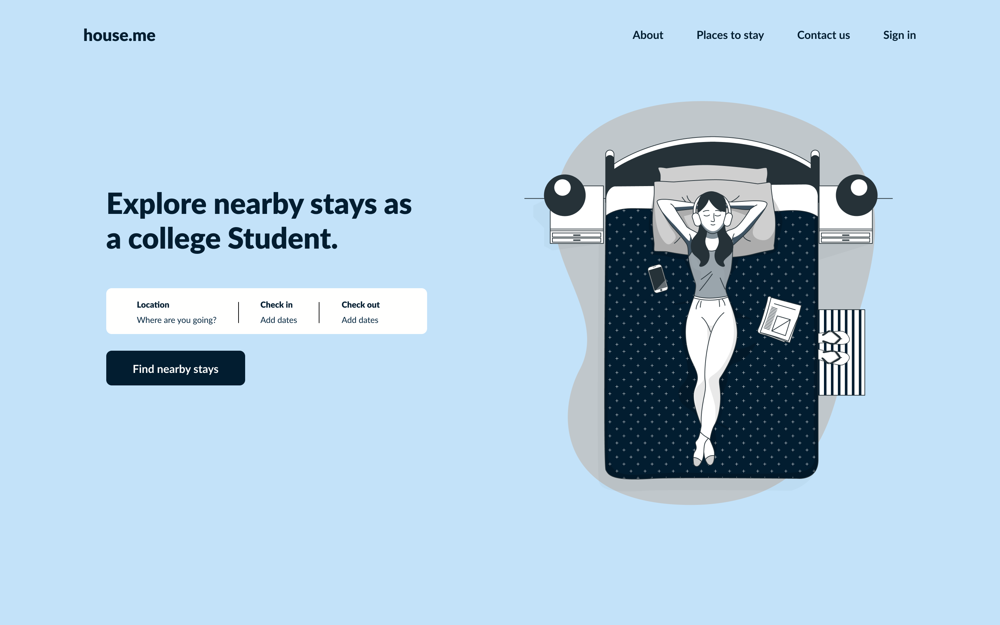;

**Idea**: A "co-living" startup focused on the business side of student housing and aiming to become the Airbnb of college housing.

**Thought Process:**

- Image: Used an image of a college student relaxing.

- Color: Used a light shade of blue for most backgrounds and a dark shade of blue for the text.

- Headline: A platform that helps college students find housing

## Day 25/30

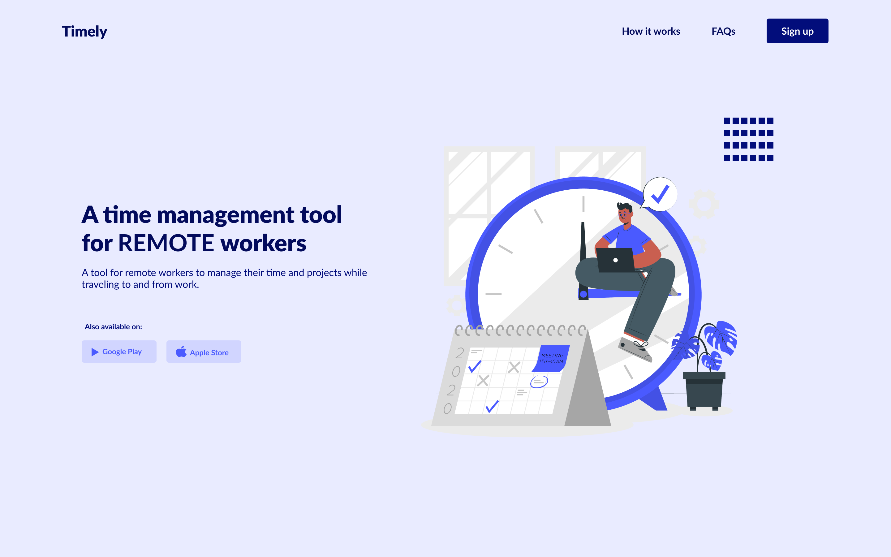;

**Idea**: A tool for remote workers to manage their time and projects while traveling to and from work.

**Thought Process:**

- Image: Used an illustration of someone working from home(remote).

- Color: Used different shades of purple for the entire webpage design.

- Headline: A platform that helps remote workers manage their time and projects.

## Day 26/30

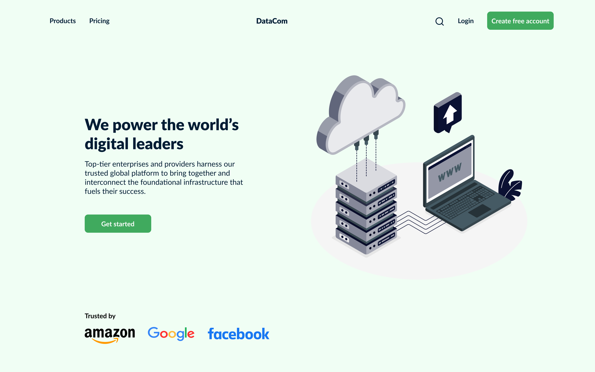;

**Idea**:A company that offers data center solutions as Software as a Service to B2B companies.

**Thought Process:**

- Image: Used an illustration that displays a laptop, servers and tools used in a data center.

- Color: Used a light shade of green for most backgrounds and a dark shade of green for the text.

- Headline: Inform customers about the services you render as a data center solutions company.

## Day 27/30

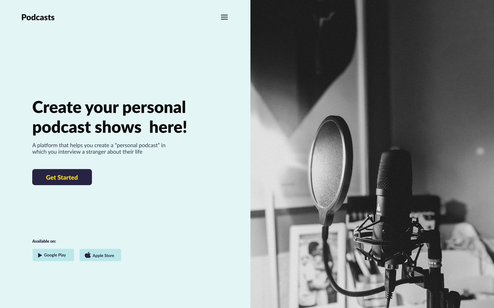;

**Idea**: A platform that helps you create a "personal podcast" in which you interview a strager about their life.

**Thought Process:**

- Image: Used an image of a studio microphone.

- Color: Used a light shade of green for most backgrounds and a dark gray color for the text.

- Headline: A platform that allows you to create a personal podcast show.

## Day 28/30

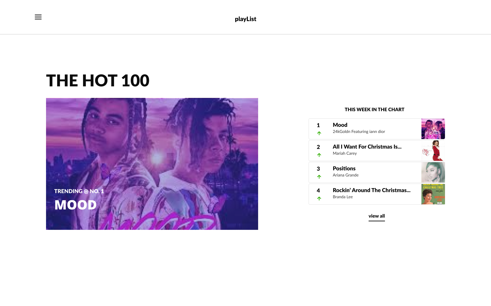;

**Idea**: A music ranking website.

**Thought Process:**

- Image: Used music cover photos.

- Color: White and Black to give the entire page a clean and minimal look.

- Headline: Top 100 Music.

## Day 29/30

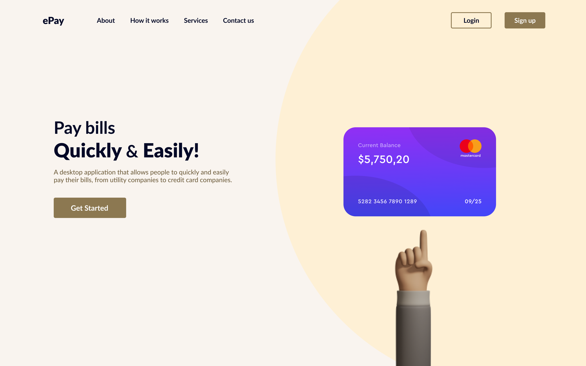;

**Idea**: A desktop application that allows people to quickly and easily pay their bills, from utility companies to credit card companies.

**Thought Process:**

- Image: Used an image of a credit card

- Color: Used different shades of orange for the background and text colors

- Headline: A platform that allows people to quickly and easily pay bills.

## Day 30/30

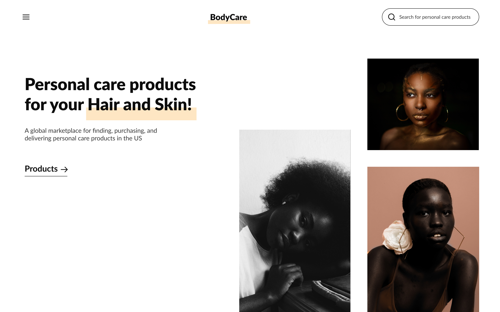;

**Idea**: A global marketplace for finding, purchasing, and delivering personal care products in the US

**Thought Process:**

- Image: Used images of female models

- Color: Black and white

- Headline: Personal care products.
