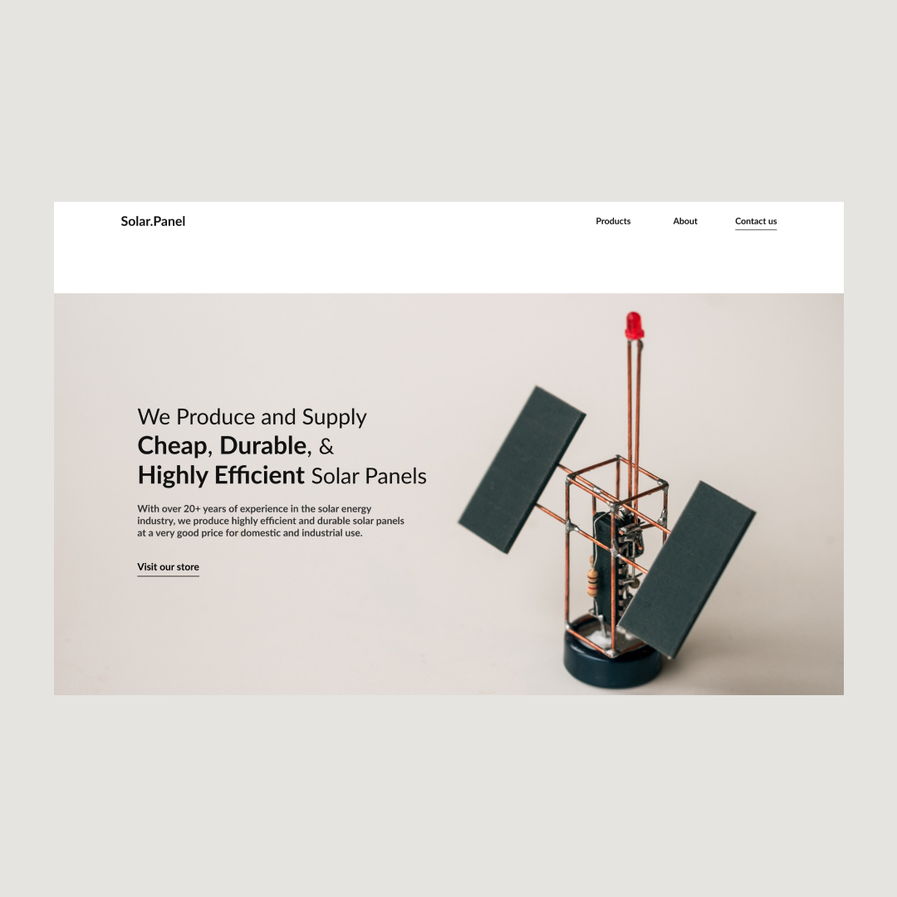

# 30DaysOfWebDesign Challenge

A challenge by [@ransegall](https://www.instagram.com/ransegall/) to build the hero section or landing page of app ideas for the next 30 days.

## Goal

The goal of this exercise is to help designers build their design muscle memory by constantly practicing.

## Rules for the Challenge

- Design the hero section of a home page
- 1 hero section per day
- 1 hour max

## Technology and Tools

- Figma

## Project Folder Structure

The folder structure for this project is very simple and straight forward. There is only one folder called screen shots that contains the images of each landing page designed each day.

## Day 1/30

Idea: Online market place where used cars can be bought from sellers and sold to buyers

**Thought Process:**

- Image: Show a car garage.
- Color: Black/White to feel premium.
- Headline: Convey safety for reassurance since that's probably the main objection.

## Day 2/30

**Idea**: A goal-oriented task list app that helps you achieve your goals by tracking your progress and mapping it to a calendar.

**Thought Process:**

- Image: Shows illustrations of how the app works
- Color: Used a monochromatic color to convey calm and soothing feeling.
- Headline: Communicates support of helping users track and achieve their goals

## Day 3/30

Concept 2:

**Idea**: A solar panel that is cheap, durable, and highly efficient.

**Thought Process:**

- Image: An image of a solar panel to showcase what the company is selling
- Color: Black and White to convey premium and durability
- Headline: Convince buyers that the product they want to buyis durable, highly effienct, and cheap.

## Day 4/30

Concept 2:

**Idea**: A startup that helps content creators such as videographers, monetize their work.

**Thought Process:**

- Image: The background picture shows a camera which is an important tool used by creatives(videographers) to perform their work.

- Color: Black and White to convey luxury, premium, and quality service.

- Headline: Communicates the benefit of using the platform which is, making money as a creative.

## Day 5/30

Concept 1:

Concept 2:

**Idea**: A high-speed way to create custom-made, high resolution 3D printed parts

**Thought Process:**

- Image: Show images of 3D objects to match the headline

- Color: Black and White. Added images with pink background to give a calm feeling.

- Headline: Inform users on how to create their own 3D parts with the help of the company.

